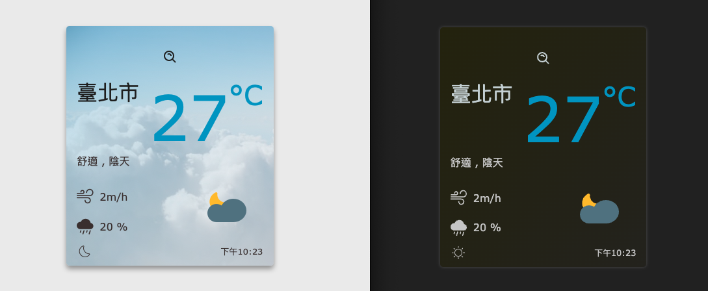
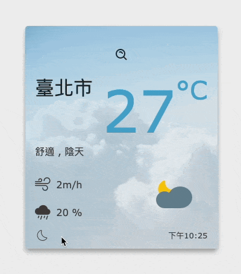

Weather cast
==

##  Overview 介紹

這是一個用React 和 Vite 建置的專案
可以查詢即時天氣的網頁
- 縣市、溫度、風速、降雨機率、天氣狀態、舒適度

### Features 專案功能
- 使用者可以點擊搜尋圖示，出現縣市選單後，查詢地點


- 使用者可以點擊左下角icon，切換深淺色模式


- 天氣圖案可以跟著日出日落的時間變換喔～

##  Getting Started 開始使用

⚠️ **請先確認電腦中已安裝 node.js 與 npm！**

1. 將專案 clone 到本地：

```bash
$ git clone "https://github.com/WeiLocus/weather-cast.git"
```

2. 在本地開啟之後，透過終端機進入資料夾，輸入：

```bash
$ npm install
```

3. 安裝完畢後，繼續輸入：

```bash
$ npm run dev
```

4. 若要暫停使用，可在終端機輸入以下指令：

```bash
ctrl/Command + c
```

### 💻 Technologies 開發環境與工具

- node.js 16.16.0
- vite 4.3.9
- styled-components 5.3.10
- vite-plugin-svgr 3.2.0
- react 18.2.0
- react-dom 18.2.0
- react-spinners 0.13.8
- dayjs 1.11.8
- eslint 8.36.0

### 📦 File Structure 專案結構

```
-- public
  |__ images
-- src
  |__ app.jsx
  |__ store
    |__ index.js
    |__ api
    |__ slice
  |__ assets
  |__ components
  |__ utils